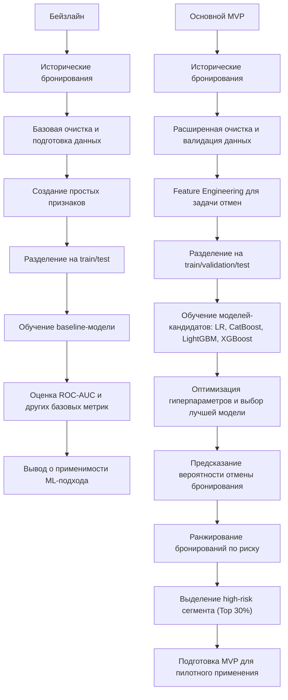
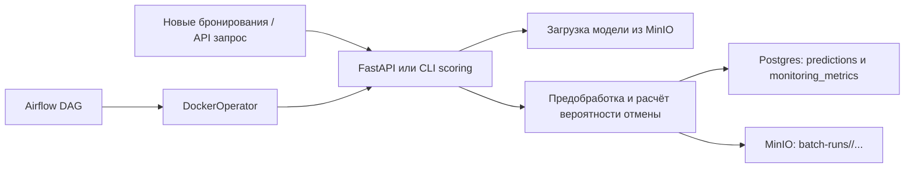

# ML System Design Doc - [RU]

## Дизайн ML системы - Прогнозирование отмен бронирований в гостиничном бизнесе

### 1. Цели и предпосылки

#### 1.1. Зачем идем в разработку продукта?  

***Бизнес-цель***  

Снизить финансовые потери от отмен бронирований и оптимизировать загрузку гостиниц за счёт прогнозирования вероятности отмены заранее. Модель будет учитывать историю клиента, сезонность, цену и тип номера, позволяя заблаговременно корректировать планирование и предлагать специальные условия, что снизит простои и повысит доходность.

***Почему станет лучше, чем сейчас, от использования ML***

Сейчас управление отменами бронирований ведётся на основе **исторических усреднённых показателей** и общих правил (например, повышенное внимание к бронированиям, сделанным менее чем за N дней до заезда, или к клиентам с предыдущими отменами), что не учитывает **индивидуальные особенности каждого бронирования** и совокупное влияние факторов, таких как сезонность, цена, тип номера и длительность проживания.

Применение ML позволит:

- **Повысить точность прогнозов отмен**, выявляя скрытые закономерности и учитывая множество факторов одновременно.
- **Снизить финансовые потери и пустые места**, позволяя заблаговременно принимать решения о перепродажах или специальных предложениях.
- **Оптимизировать работу персонала**, предоставляя готовые прогнозы и сокращая ручной труд по анализу бронирований.

***Что будем считать успехом итерации с точки зрения бизнеса***

- Увеличение дохода или сокращение потерь от отмен хотя бы на 5–10% по сравнению с текущим процессом.  
- Прогнозы модели легко доступны и понятны для сотрудников гостиницы: менеджеры используют прогнозы для принятия решений в ≥ 80% случаев.
- Модель позволяет заранее выявлять бронирования с высокой вероятностью отмены, благодаря чему менеджеры оперативно перераспределяют номера и сокращают пустые места; доля пустых мест снижается хотя бы на 5% по сравнению с текущим процессом.
- Модель предоставляет прогнозы сразу после бронирования, что позволяет при необходимости предпринимать меры (например, напоминание клиенту или предложение бонуса) без задержек.

#### 1.2. Бизнес-требования и ограничения  

***Краткое описание БТ***  

Снижение потерь от отмен бронирований за счет использования модели для раннего выявления высокорисковых бронирований. Система предоставляет для каждого бронирования оценку вероятности отмены, позволяющую бизнесу принимать более обоснованные решения.

***Бизнес-ограничения***

- Используется только исторический датасет бронирований без внешнего обогащения (CRM, платежные данные, поведение пользователей).
- Модель не должна требовать признаков, недоступных на момент принятия решения (например, данных, появляющихся после бронирования).
- Решение должно быть интерпретируемым на уровне сегментов, чтобы бизнес мог понимать, какие группы клиентов имеют повышенный риск отмены.
- Использование модели не должно ухудшать клиентский опыт (например, приводить к чрезмерно агрессивным ограничениям или дискриминации отдельных групп клиентов).

***Что мы ожидаем от конкретной итерации***  

- Построение baseline ML-решения, способного предсказывать вероятность отмены бронирования с приемлемым качеством.
- Получение воспроизводимого пайплайна подготовки данных, обучения модели и генерации предсказаний.
- Выделение сегмента высокорисковых бронирований, пригодного для использования в бизнес-логике.
- Подготовка результатов для проведения пилотного тестирования и последующей оценки бизнес-эффекта.

***Описание бизнес-процесса пилота, насколько это возможно - как именно мы будем использовать модель в существующем бизнес-процессе?***

В рамках пилота модель используется в batch-режиме для расчета вероятности отмены по всем новым бронированиям. На основе предсказаний формируется таблица с вероятностями отмены и ранжированием бронирований. Далее выделяется сегмент высокого риска (например, Top-30%) и передается бизнесу (аналитикам / операционным системам).

Возможные сценарии использования:

- Применение более строгих условий бронирования для высокорисковых клиентов
- Запуск дополнительных коммуникаций (подтверждение брони, напоминания)
- Корректировка стратегии overbooking

***Что считаем успешным пилотом***

- Модель показывает устойчивое качество на тестовых данных (например, ROC-AUC выше baseline).
- Выделенный сегмент высокого риска демонстрирует значимо более высокий уровень отмен по сравнению с остальными бронированиями.
- Бизнес может интерпретировать результаты и использовать их для принятия решений.
- Пайплайн воспроизводим и стабильно работает при повторных запусках.

***Возможные пути развития проекта***

- Внедрение онлайн-инференса и интеграция модели в операционные системы.
- Добавление внешних источников данных (CRM, поведенческие данные, платежная информация).
- Развитие feature engineering и использование более сложных моделей или ансамблей.
- Автоматизация переобучения модели и внедрение мониторинга качества (ML-метрики, PSI/CSI).
- Проведение полноценного A/B-тестирования и оценка бизнес-эффекта (снижение отмен, рост выручки).

#### 1.3. Что входит в скоуп проекта/итерации, что не входит

***На закрытие каких БТ подписываемся в данной итерации***

- Подготовка обучающей выборки: формирование витрины данных на основе предоставленного датасета бронирований (booking.csv). В витрину включаются такие признаки как история отмен бронирований, тип номера, количество ночей и тд.
- Разработка прогнозного механизма: обучение модели бинарной классификации для расчета индивидуальной вероятности отмены бронирования, на выходе формирует вероятность отмены в диапазоне от 0 до 1.
- Формирование риск-сегмента: ранжирование всех бронирований по вероятности отмены, выделение сегмента высокого риска (например, Top-30% бронирований с наибольшей вероятностью отмены).
- Подготовка к пилоту: формирование структуры данных для проведения офлайн-оценки модели и последующего A/B-тестирования.

***Что не будет закрыто***  

- Внешнее обогащение данных: использование внешних источников (CRM, платежные данные, поведение на сайте) не входит в текущую итерацию. Используется только исходный датасет и производные признаки на его основе.
- Расширение горизонта прогнозирования: модель прогнозирует только факт отмены конкретного бронирования. Другие задачи (churn, повторные бронирования) не рассматриваются.
- Автоматическое принятие бизнес-решений: система не реализует автоматические действия. Она формирует скоринг, который может использоваться для принятия решений внешними системами.
- Пост-аналитика бизнес-эффекта: оценка влияния модели на бизнес-метрики проводится после пилота и не входит в текущую итерацию.
  
***Описание результата с точки зрения качества кода и воспроизводимости решения***

Результатом является воспроизводимый ML-пайплайн, включающий:

- Подготовку данных из booking.csv,
- Предобработку признаков (очистка, кодирование категориальных переменных),
- Обучение модели,
- Генерацию предсказаний.

Пайплайн обеспечивает:

Однозначную логику обработки данных, фиксированные версии датасета и параметров модели, возможность повторного запуска на новых данных без изменения кода. Выходные данные имеют стандартизированный формат: booking_id – probability_of_cancellation – rank. Это обеспечивает возможность интеграции результата в downstream-системы и использование в аналитике.

***Описание планируемого технического долга (что оставляем для дальнейшей продуктивизации)***  

- Автоматизация (например, запуск по расписанию) откладывается до подтверждения качества модели.
- Глубокая оптимизация (grid search, Bayesian optimization) переносится на следующие этапы.
- Расширение признакового пространства, добавление новых производных признаков и более сложных зависимостей откладывается.

#### 1.4. Предпосылки решения  

***Описание всех общих предпосылок решения, используемых в системе – с обоснованием от запроса бизнеса: какие блоки данных используем, горизонт прогноза, гранулярность модели, и др.***

Использование только исходных признаков датасета недостаточно для качественного прогноза. Добавление производных признаков (total_nights, price_per_night, is_family, временные признаки) позволяет лучше отразить поведение клиентов и повысить точность модели.

- Модель решает задачу бинарной классификации — прогнозирует вероятность отмены конкретного бронирования (is_canceled), что напрямую соответствует бизнес-задаче снижения отмен.
- Гранулярность модели — уровень отдельного бронирования (booking_id), что позволяет применять результаты для каждого конкретного случая.
- Ранжирование по вероятности отмены более эффективно, чем rule-based подход, так как учитывает совокупность факторов и их взаимодействия.
- В MVP система использует только данные датасета и работает в оффлайн-режиме, что упрощает реализацию и обеспечивает воспроизводимость решения.  

---

### 2. Методология

#### 2.1. Постановка задачи

***Что делаем с технической точки зрения***

С технической точки зрения задача формулируется как задача бинарной классификации: необходимо предсказать вероятность отмены бронирования на основе доступной информации о клиенте, параметрах бронирования и контексте.

Входные данные представляют собой табличный датасет с информацией о бронированиях (характеристики клиента, тип номера, длительность проживания, цена, канал бронирования и т.д.).

Целевая переменная — is_canceled (0 — бронирование не отменено, 1 — отменено).

Модель должна:

- Принимать данные о новом бронировании сразу после его создания,
- Возвращать вероятность отмены (а не только класс),
- Работать в batch-режиме для оценки всех новых бронирований.

Результат модели используется для:

- Ранжирования бронирований по риску отмены,
- Выделения сегмента высокорисковых бронирований (например, топ-30% по вероятности),
- Передачи результатов в бизнес-процессы (уведомления, корректировка политики бронирования, overbooking).

Качество модели оценивается с использованием метрик классификации (ROC-AUC, precision/recall), с приоритетом на корректное выявление бронирований с высокой вероятностью отмены.

#### 2.2. Блок-схема решения

***Блок-схема для бейзлайна и основного MVP с ключевыми этапами решения задачи***

Блок-схема решения отражает последовательность ключевых этапов разработки ML-модели прогнозирования отмен бронирований — от подготовки данных до получения бизнес-значимого результата. Ниже представлены два уровня решения: бейзлайн для проверки гипотезы и основной MVP с расширенной предобработкой, подбором моделей и формированием целевого сегмента высокорисковых бронирований.

#### 2.3. Этапы решения задачи

Проектирование решения разбито на последовательные этапы: от формирования витрины данных на уровне бронирования до подготовки результатов для пилотного использования в бизнес-процессе управления отменами.

***Этап 1 — Подготовка данных и проектирование витрины***

На данном этапе производится подготовка аналитической витрины данных на уровне отдельного бронирования (`booking_id`) на основе исходного датасета `booking.csv`.

***Данные и валидация***

| Компонент данных | Источник формирования | Функциональное назначение | Контроль качества |
| :--- | :--- | :--- | :--- |
| **Данные бронирований** (`booking_id`, даты, цена, тип номера, канал) | Исходный датасет `booking.csv` | Формирование базовых признаков модели | Проверка типов данных, корректности дат (дата заезда > даты бронирования), удаление дубликатов |
| **Целевая переменная** (`is_canceled`) | Поле в датасете | Формирование обучающего сигнала | Проверка распределения классов, анализ дисбаланса |
| **Производные признаки** | Feature Engineering Pipeline | Учет поведения клиента и контекста бронирования | Проверка распределений, устранение выбросов |
| **Временные признаки** | Генерация на основе дат | Учет сезонности и временных паттернов | Проверка корректности календарных преобразований |

***Примеры производных признаков***

- `total_nights` — длительность проживания  
- `total_guests` — общее количество гостей
- `price_per_night` — цена за ночь
- `previous_cancel_ratio` — доля отмен клиента  

***Результат этапа***

Сформированная витрина данных (Feature Store) на уровне `booking_id`, пригодная для обучения модели и последующего скоринга.

***Этап 2 — Разработка прогнозной модели***

**Baseline:**

- Алгоритм: логистическая регрессия
- Признаки: базовые характеристики бронирования (цена, длительность, lead time)  
- Цель: задать минимальный уровень качества  

**MVP (основная модель):**

- Алгоритм: градиентный бустинг (LightGBM / CatBoost)  
- Причины выбора:
  - хорошо работает с табличными данными  
  - устойчив к нелинейным зависимостям  
  - эффективно работает с категориальными признаками  

**Feature engineering:**

- добавление взаимодействий признаков  
- временные признаки  
- агрегаты по клиенту  

***Метрики качества***

- ROC-AUC ≥ 0.70  
- Precision / Recall для класса отмен  

**Бизнес-метрика:**

- Lift в Top-30% сегменте ≥ 1.5  

**Утечка данных (data leakage):**

- исключение признаков, недоступных на момент бронирования  

**Переобучение:**

- кросс-валидация  
- регуляризация модели  

***Этап 3 — Подготовка инференса и интеграция с бизнес-процессом***

Создается пайплайн применения обученной модели к новым бронированиям в batch-режиме.

***Процесс***

1. Получение новых бронирований  
2. Применение feature engineering  
3. Расчет вероятности отмены для каждого `booking_id`  
4. Ранжирование бронирований по риску  

***Формирование сегмента***

- Выделяется Top-30% бронирований с наибольшей вероятностью отмены  
- Сегмент передается в бизнес  

***Использование результатов***

- запуск коммуникаций с клиентами  
- корректировка условий бронирования  
- управление overbooking  

---

### 3. Подготовка пилота

#### 3.1. Способ оценки пилота

Пилот предлагается проводить в офлайн-режиме с последующей ограниченной операционной проверкой на новых бронированиях. На первом шаге оценивается качество модели на отложенной тестовой выборке и на batch-наборе новых бронирований: сравниваются baseline-модель и основной MVP по ROC-AUC, precision/recall и lift в high-risk сегменте. На втором шаге результаты batch scoring передаются бизнес-пользователю как список бронирований с вероятностью отмены и флагом высокого риска.

Дизайн пилота:

- **Контроль** — текущий процесс без ML: решения принимаются по историческим усреднённым правилам и ручному анализу.
- **Тест** — использование batch-скоринга: для новых бронирований рассчитывается вероятность отмены, затем выделяется high-risk сегмент Top-30%.
- **Единица анализа** — отдельное бронирование.
- **Горизонт наблюдения** — период между созданием бронирования и фактом его отмены или неотмены.
- **Способ оценки** — сравнение качества выделения high-risk сегмента с baseline-подходом и анализ доли фактических отмен в сегменте высокого риска.

Так как в рамках текущей итерации нет полноценной интеграции в продукт и онлайн-эксперимента, пилот оценивается как **offline pilot / shadow mode**: бизнес получает прогнозы, но решение об изменении условий бронирования или коммуникаций принимает вручную.

#### 3.2. Что считаем успешным пилотом

Успешным пилотом считаем выполнение одновременно технических и бизнес-критериев:

**Технические критерии:**

- ROC-AUC основной модели не ниже 0.70 и выше baseline-модели.
- Сегмент high-risk (Top-30% бронирований) показывает lift не ниже 1.5 по отношению к среднему уровню отмен.
- Пайплайн batch scoring стабильно выполняется повторно без ручного переписывания кода.
- Для одного и того же `run_date` не создаются дубликаты результатов: повторный запуск перезаписывает данные за дату и оставляет один актуальный набор файлов.

**Бизнес-критерии:**

- Список high-risk бронирований пригоден для работы менеджеров и интерпретируем на уровне сегментов.
- Бизнес подтверждает, что по результатам скоринга можно запускать действия: напоминания клиентам, корректировку условий бронирования, ручное управление overbooking.
- Потенциальный эффект пилота оценивается как значимый: снижение потерь от отмен или доли пустых мест не менее чем на 5% относительно текущего процесса.

Если по итогам пилота технические метрики достигаются, но бизнес-эффект недостаточно выражен, следующая итерация должна быть направлена на расширение признаков и интеграцию в более близкий к production бизнес-процесс.

#### 3.3. Подготовка пилота

Пилот строится на уже реализованной локальной инфраструктуре: обученная модель сохраняется в S3-совместимое хранилище MinIO, batch scoring запускается через Airflow DAG, а результаты дополнительно записываются в Postgres и MinIO. Это позволяет провести демонстрацию полного контура без отдельного production-окружения.

Что требуется для подготовки пилота:

1. **Подготовить окружение**
   - поднять Postgres, MinIO и Airflow через Docker Compose;
   - заполнить `.env` локальными параметрами;
   - завести секреты в Airflow Variables (`POSTGRES_PASSWORD`, `S3_ACCESS_KEY`, `S3_SECRET_KEY` и др.).

2. **Подготовить модель и артефакты**
   - обучить LightGBM-модель;
   - сохранить артефакты модели в MinIO по префиксу `artifacts/`;
   - убедиться, что API и batch-CLI могут загрузить модель из S3/MinIO.

3. **Подготовить batch-данные для пилота**
   - использовать файл `data/raw/new_bookings.csv` как входной набор новых бронирований;
   - выполнить batch scoring с указанием `run_date`;
   - сформировать выходные CSV-файлы `booking_risk_scores.csv` и `high_risk_bookings.csv`.

4. **Подготовить критерии анализа**
   - заранее зафиксировать порог или долю high-risk сегмента (`DEFAULT_BATCH_RISK_SHARE=0.3`);
   - определить, какие действия бизнес будет тестировать на сегменте высокого риска;
   - подготовить шаблон отчёта по результатам пилота.

**Оценка вычислительной сложности и ограничений:**

Для MVP используется табличная модель градиентного бустинга и batch scoring по файлу новых бронирований. Объем данных невелик, поэтому вычислительная стоимость локального запуска низкая: обучение и batch scoring выполняются на одном хосте без выделенного кластера. Для пилота это допустимо, поскольку нет требований к real-time latency и высокой пропускной способности.

Если объём данных вырастет, потребуется:

- вынести MinIO и Postgres в отдельные управляемые сервисы;
- настроить регулярное переобучение и мониторинг;
- пересмотреть формат batch processing и объёмы входных файлов.

**Результат подготовки пилота:**

- воспроизводимый локальный контур запуска;
- артефакты модели в объектном хранилище;
- DAG для batch scoring и проверки результатов;
- CSV-результаты в MinIO по пути `batch-runs/<run_date>/`;
- возможность показать бизнесу полный цикл от входного файла до high-risk сегмента.

---

### 4. Внедрение

#### 4.1. Архитектура решения

Система построена как локальный ML-сервис с разделением на онлайн- и batch-контур.

**Основные компоненты:**

- **FastAPI API** — предоставляет методы `/health`, `/predict`, `/predict/batch` для online inference и проверки готовности сервиса.
- **ML-модель и артефакты** — обученная LightGBM-модель и отчет по сравнению моделей хранятся в MinIO.
- **Airflow DAG** — оркестрирует ежедневный batch scoring через `DockerOperator`.
- **Postgres** — хранит prediction records и monitoring metrics по batch- и ad-hoc-запускам.
- **MinIO (S3-compatible storage)** — хранит артефакты модели и результаты batch scoring.
- **CLI-слой** — отдельные команды для инициализации БД, обучения модели, batch scoring и проверки результатов.

Упрощённая схема взаимодействия:

**Назначение API-методов:**

- `GET /health` — проверка, что сервис поднят и модель загружена.
- `POST /predict` — предсказание вероятности отмены для одного бронирования.
- `POST /predict/batch` — предсказание для списка бронирований в запросе.

Для batch-контура основной оркестрацией служит DAG `booking_batch_scoring`, который выполняет три последовательных задачи:

1. `check_batch_not_processed` — проверка, существуют ли outputs за `run_date`.
2. `run_batch_scoring` — запуск основного batch scoring.
3. `verify_batch_outputs` — проверка наличия CSV-файлов и `_SUCCESS` marker в MinIO.

#### 4.2. Описание инфраструктуры и масштабируемости

**Выбранная инфраструктура:**

- локальный запуск через Docker Compose;
- один контейнер Postgres;
- один контейнер MinIO;
- один контейнер Airflow standalone;
- Python/FastAPI сервис и Docker image приложения для batch-задач.

**Почему выбрана именно такая инфраструктура:**

- она минимально достаточна для MVP и демонстрации end-to-end процесса;
- позволяет отделить хранение артефактов модели от кода приложения;
- подходит для отладки batch orchestration и проверки идемпотентности запусков;
- не требует внешнего облака и дополнительных DevOps-ресурсов.

**Плюсы выбора:**

- простота локального воспроизведения;
- низкая стоимость запуска;
- понятная трассировка данных от входного файла до результатов;
- наличие отдельного orchestration layer через Airflow.

**Минусы выбора:**

- нет отказоустойчивости и production-grade деплоя;
- масштабируемость ограничена ресурсами одной машины;
- секреты для локальной среды задаются через Airflow UI и `.env`, а не через централизованный secret manager;
- нет CI/CD и автоматизированного выката.

**Почему это лучше альтернатив на текущем этапе:**

Для учебного MVP избыточно сразу внедрять Kubernetes, managed S3 и отдельный секрет-менеджер. Текущая инфраструктура закрывает требования итерации: обучение модели, batch scoring, хранение артефактов и демонстрацию end-to-end ML-системы. Для production следующей итерацией будет вынос инфраструктурных компонентов в управляемые сервисы.

#### 4.3. Требования к работе системы

Для текущего MVP требования формулируются как требования к batch-сервису и базовому online inference:

- **SLA для MVP:** не формализован как production SLA, но система должна стабильно подниматься локально и выполнять полный batch run без ручного изменения кода.
- **Пропускная способность API:** достаточна для обработки одиночных запросов и небольших batch-запросов в демонстрационном режиме.
- **Задержка online inference:** приемлема на уровне единиц секунд, так как запросы идут к одной загруженной модели без внешних удалённых вызовов, кроме загрузки артефакта при старте сервиса.
- **Задержка batch scoring:** приемлема в пределах одного DAG run для ежедневного запуска.
- **Идемпотентность batch-run:** повторный запуск за тот же `run_date` не должен создавать дубликаты данных в MinIO и Postgres.

Для production-версии потребуются формальные значения latency и throughput, а также нагрузочное тестирование.

#### 4.4. Безопасность системы

Потенциальные уязвимости системы:

- секреты локальной среды частично задаются через `.env` и Airflow Variables, что приемлемо для MVP, но недостаточно для production;
- `DockerOperator` использует доступ к Docker socket, что в production требует отдельного контроля прав доступа;
- MinIO и Airflow в локальной среде доступны через открытые локальные порты;
- отсутствует централизованный аудит доступа к секретам и объектному хранилищу.

Что сделано на уровне MVP:

- секреты не захардкожены в коде DAG;
- чувствительные значения передаются в задачи через Airflow Variables;
- параметры окружения разделены: host-side `.env` для локального запуска и Airflow Variables для batch DAG.

Что нужно сделать в production:

- использовать secret manager;
- ограничить сетевой доступ к Airflow, MinIO и Postgres;
- убрать прямой доступ к Docker socket или заменить способ запуска задач;
- ввести ротацию секретов и аудит изменений.

#### 4.5. Безопасность данных

В текущем проекте используются табличные данные бронирований. В учебном наборе не рассматриваются чувствительные платежные данные или прямые идентификаторы личности в объеме, характерном для production CRM-систем. Тем не менее, при реальном внедрении необходимо проверить:

- не содержат ли входные данные персональные данные клиентов;
- допустимо ли использовать историю отмен и поведение клиента для автоматизированной оценки риска;
- не нарушает ли сегментация high-risk требования локального законодательства и внутренних политик компании;
- соблюдаются ли требования GDPR и аналогичных норм при хранении и обработке бронирований.

Для MVP предполагается, что данные обезличены или используются в рамках внутреннего пилота с допустимым правовым основанием.

#### 4.6. Издержки

Для текущего MVP прямые денежные издержки минимальны, так как все компоненты запускаются локально на одной машине:

- Docker Compose — без отдельной инфраструктурной платы;
- MinIO — локально;
- Postgres — локально;
- Airflow — локально;
- вычисления выполняются на CPU без выделенного GPU.

Основные затраты на текущем этапе — это время разработки и сопровождения:

- подготовка признаков и обучение модели;
- поддержка DAG и batch-логики;
- ручное заведение секретов и запусков в локальной среде.

При переносе в production издержки появятся в виде:

- managed object storage;
- managed database;
- orchestration platform;
- мониторинг, логирование, CI/CD и секрет-менеджмент.

#### 4.7. Integration points

Ключевые точки интеграции между сервисами:

- **FastAPI ↔ MinIO** — на старте API модель загружается из объектного хранилища.
- **CLI scoring ↔ MinIO** — batch scoring загружает модельные артефакты и сохраняет batch outputs.
- **CLI scoring ↔ Postgres** — результаты скоринга и monitoring metrics сохраняются в таблицы `predictions` и `monitoring_metrics`.
- **Airflow ↔ DockerOperator** — Airflow запускает контейнер приложения и передает в него `run_date` и переменные окружения.
- **Airflow ↔ Airflow Variables** — секреты и параметры batch-run читаются через `{{ var.value.* }}`.

Для batch DAG учетные данные передаются так:

1. секреты создаются в Airflow UI (`Admin -> Variables`);
2. DAG подставляет их в `environment` DockerOperator;
3. контейнер получает их как переменные окружения;
4. Python-код внутри контейнера использует эти значения для подключения к Postgres и MinIO.

#### 4.8. Риски

Основные риски и неопределённости:

- **ограниченность данных** — используется только один исторический датасет без внешнего обогащения;
- **смещение данных во времени** — поведение клиентов и паттерны отмен могут изменяться сезонно;
- **ложноположительные срабатывания** — часть клиентов может быть ошибочно отнесена к high-risk сегменту;
- **ограниченная инфраструктура MVP** — локальная среда не гарантирует production-надежность;
- **отсутствие версионирования batch outputs** — повторный запуск за одну и ту же дату перезаписывает результат, а не сохраняет историю всех версий;
- **ручное управление секретами** — для MVP это допустимо, но в production создает операционные риски.

План снижения рисков:

- в следующей итерации добавить мониторинг качества и drift-метрики;
- формализовать правила работы с high-risk сегментом вместе с бизнесом;
- внедрить централизованное хранение секретов;
- перейти к более production-ориентированной инфраструктуре и наблюдаемости.