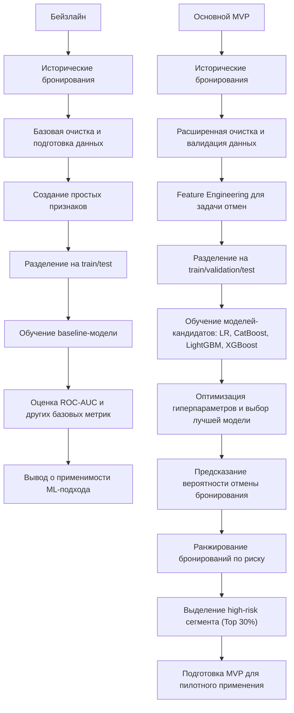

# ML System Design Doc - [RU]

## Дизайн ML системы - Прогнозирование отмен бронирований в гостиничном бизнесе

### 1. Цели и предпосылки

#### 1.1. Зачем идем в разработку продукта?  

***Бизнес-цель***  

Снизить финансовые потери от отмен бронирований и оптимизировать загрузку гостиниц за счёт прогнозирования вероятности отмены заранее. Модель будет учитывать историю клиента, сезонность, цену и тип номера, позволяя заблаговременно корректировать планирование и предлагать специальные условия, что снизит простои и повысит доходность.

***Почему станет лучше, чем сейчас, от использования ML***

Сейчас управление отменами бронирований ведётся на основе **исторических усреднённых показателей** и общих правил (например, повышенное внимание к бронированиям, сделанным менее чем за N дней до заезда, или к клиентам с предыдущими отменами), что не учитывает **индивидуальные особенности каждого бронирования** и совокупное влияние факторов, таких как сезонность, цена, тип номера и длительность проживания.

Применение ML позволит:

- **Повысить точность прогнозов отмен**, выявляя скрытые закономерности и учитывая множество факторов одновременно.
- **Снизить финансовые потери и пустые места**, позволяя заблаговременно принимать решения о перепродажах или специальных предложениях.
- **Оптимизировать работу персонала**, предоставляя готовые прогнозы и сокращая ручной труд по анализу бронирований.

***Что будем считать успехом итерации с точки зрения бизнеса***

- Увеличение дохода или сокращение потерь от отмен хотя бы на 5–10% по сравнению с текущим процессом.  
- Прогнозы модели легко доступны и понятны для сотрудников гостиницы: менеджеры используют прогнозы для принятия решений в ≥ 80% случаев.
- Модель позволяет заранее выявлять бронирования с высокой вероятностью отмены, благодаря чему менеджеры оперативно перераспределяют номера и сокращают пустые места; доля пустых мест снижается хотя бы на 5% по сравнению с текущим процессом.
- Модель предоставляет прогнозы сразу после бронирования, что позволяет при необходимости предпринимать меры (например, напоминание клиенту или предложение бонуса) без задержек.

#### 1.2. Бизнес-требования и ограничения  

***Краткое описание БТ***  

Снижение потерь от отмен бронирований за счет использования модели для раннего выявления высокорисковых бронирований. Система предоставляет для каждого бронирования оценку вероятности отмены, позволяющую бизнесу принимать более обоснованные решения.

***Бизнес-ограничения***

- Используется только исторический датасет бронирований без внешнего обогащения (CRM, платежные данные, поведение пользователей).
- Модель не должна требовать признаков, недоступных на момент принятия решения (например, данных, появляющихся после бронирования).
- Решение должно быть интерпретируемым на уровне сегментов, чтобы бизнес мог понимать, какие группы клиентов имеют повышенный риск отмены.
- Использование модели не должно ухудшать клиентский опыт (например, приводить к чрезмерно агрессивным ограничениям или дискриминации отдельных групп клиентов).

***Что мы ожидаем от конкретной итерации***  

- Построение baseline ML-решения, способного предсказывать вероятность отмены бронирования с приемлемым качеством.
- Получение воспроизводимого пайплайна подготовки данных, обучения модели и генерации предсказаний.
- Выделение сегмента высокорисковых бронирований, пригодного для использования в бизнес-логике.
- Подготовка результатов для проведения пилотного тестирования и последующей оценки бизнес-эффекта.

***Описание бизнес-процесса пилота, насколько это возможно - как именно мы будем использовать модель в существующем бизнес-процессе?***

В рамках пилота модель используется в batch-режиме для расчета вероятности отмены по всем новым бронированиям. На основе предсказаний формируется таблица с вероятностями отмены и ранжированием бронирований. Далее выделяется сегмент высокого риска (например, Top-30%) и передается бизнесу (аналитикам / операционным системам).

Возможные сценарии использования:

- Применение более строгих условий бронирования для высокорисковых клиентов
- Запуск дополнительных коммуникаций (подтверждение брони, напоминания)
- Корректировка стратегии overbooking

***Что считаем успешным пилотом***

- Модель показывает устойчивое качество на тестовых данных (например, ROC-AUC выше baseline).
- Выделенный сегмент высокого риска демонстрирует значимо более высокий уровень отмен по сравнению с остальными бронированиями.
- Бизнес может интерпретировать результаты и использовать их для принятия решений.
- Пайплайн воспроизводим и стабильно работает при повторных запусках.

***Возможные пути развития проекта***

- Внедрение онлайн-инференса и интеграция модели в операционные системы.
- Добавление внешних источников данных (CRM, поведенческие данные, платежная информация).
- Развитие feature engineering и использование более сложных моделей или ансамблей.
- Автоматизация переобучения модели и внедрение мониторинга качества (ML-метрики, PSI/CSI).
- Проведение полноценного A/B-тестирования и оценка бизнес-эффекта (снижение отмен, рост выручки).

#### 1.3. Что входит в скоуп проекта/итерации, что не входит

***На закрытие каких БТ подписываемся в данной итерации***

- Подготовка обучающей выборки: формирование витрины данных на основе предоставленного датасета бронирований (booking.csv). В витрину включаются такие признаки как история отмен бронирований, тип номера, количество ночей и тд.
- Разработка прогнозного механизма: обучение модели бинарной классификации для расчета индивидуальной вероятности отмены бронирования, на выходе формирует вероятность отмены в диапазоне от 0 до 1.
- Формирование риск-сегмента: ранжирование всех бронирований по вероятности отмены, выделение сегмента высокого риска (например, Top-30% бронирований с наибольшей вероятностью отмены).
- Подготовка к пилоту: формирование структуры данных для проведения офлайн-оценки модели и последующего A/B-тестирования.

***Что не будет закрыто***  

- Внешнее обогащение данных: использование внешних источников (CRM, платежные данные, поведение на сайте) не входит в текущую итерацию. Используется только исходный датасет и производные признаки на его основе.
- Расширение горизонта прогнозирования: модель прогнозирует только факт отмены конкретного бронирования. Другие задачи (churn, повторные бронирования) не рассматриваются.
- Автоматическое принятие бизнес-решений: система не реализует автоматические действия. Она формирует скоринг, который может использоваться для принятия решений внешними системами.
- Пост-аналитика бизнес-эффекта: оценка влияния модели на бизнес-метрики проводится после пилота и не входит в текущую итерацию.
  
***Описание результата с точки зрения качества кода и воспроизводимости решения***

Результатом является воспроизводимый ML-пайплайн, включающий:

- Подготовку данных из booking.csv,
- Предобработку признаков (очистка, кодирование категориальных переменных),
- Обучение модели,
- Генерацию предсказаний.

Пайплайн обеспечивает:

Однозначную логику обработки данных, фиксированные версии датасета и параметров модели, возможность повторного запуска на новых данных без изменения кода. Выходные данные имеют стандартизированный формат: booking_id – probability_of_cancellation – rank. Это обеспечивает возможность интеграции результата в downstream-системы и использование в аналитике.

***Описание планируемого технического долга (что оставляем для дальнейшей продуктивизации)***  

- Автоматизация (например, запуск по расписанию) откладывается до подтверждения качества модели.
- Глубокая оптимизация (grid search, Bayesian optimization) переносится на следующие этапы.
- Расширение признакового пространства, добавление новых производных признаков и более сложных зависимостей откладывается.

#### 1.4. Предпосылки решения  

***Описание всех общих предпосылок решения, используемых в системе – с обоснованием от запроса бизнеса: какие блоки данных используем, горизонт прогноза, гранулярность модели, и др.***

Использование только исходных признаков датасета недостаточно для качественного прогноза. Добавление производных признаков (total_nights, price_per_night, is_family, временные признаки) позволяет лучше отразить поведение клиентов и повысить точность модели.

- Модель решает задачу бинарной классификации — прогнозирует вероятность отмены конкретного бронирования (is_canceled), что напрямую соответствует бизнес-задаче снижения отмен.
- Гранулярность модели — уровень отдельного бронирования (booking_id), что позволяет применять результаты для каждого конкретного случая.
- Ранжирование по вероятности отмены более эффективно, чем rule-based подход, так как учитывает совокупность факторов и их взаимодействия.
- В MVP система использует только данные датасета и работает в оффлайн-режиме, что упрощает реализацию и обеспечивает воспроизводимость решения.  

---

### 2. Методология

#### 2.1. Постановка задачи

***Что делаем с технической точки зрения***

С технической точки зрения задача формулируется как задача бинарной классификации: необходимо предсказать вероятность отмены бронирования на основе доступной информации о клиенте, параметрах бронирования и контексте.

Входные данные представляют собой табличный датасет с информацией о бронированиях (характеристики клиента, тип номера, длительность проживания, цена, канал бронирования и т.д.).

Целевая переменная — is_canceled (0 — бронирование не отменено, 1 — отменено).

Модель должна:

- Принимать данные о новом бронировании сразу после его создания,
- Возвращать вероятность отмены (а не только класс),
- Работать в batch-режиме для оценки всех новых бронирований.

Результат модели используется для:

- Ранжирования бронирований по риску отмены,
- Выделения сегмента высокорисковых бронирований (например, топ-30% по вероятности),
- Передачи результатов в бизнес-процессы (уведомления, корректировка политики бронирования, overbooking).

Качество модели оценивается с использованием метрик классификации (ROC-AUC, precision/recall), с приоритетом на корректное выявление бронирований с высокой вероятностью отмены.

#### 2.2. Блок-схема решения

***Блок-схема для бейзлайна и основного MVP с ключевыми этапами решения задачи***

Блок-схема решения отражает последовательность ключевых этапов разработки ML-модели прогнозирования отмен бронирований — от подготовки данных до получения бизнес-значимого результата. Ниже представлены два уровня решения: бейзлайн для проверки гипотезы и основной MVP с расширенной предобработкой, подбором моделей и формированием целевого сегмента высокорисковых бронирований.

#### 2.3. Этапы решения задачи

Проектирование решения разбито на последовательные этапы: от формирования витрины данных на уровне бронирования до подготовки результатов для пилотного использования в бизнес-процессе управления отменами.

***Этап 1 — Подготовка данных и проектирование витрины***

На данном этапе производится подготовка аналитической витрины данных на уровне отдельного бронирования (`booking_id`) на основе исходного датасета `booking.csv`.

***Данные и валидация***

| Компонент данных | Источник формирования | Функциональное назначение | Контроль качества |
| :--- | :--- | :--- | :--- |
| **Данные бронирований** (`booking_id`, даты, цена, тип номера, канал) | Исходный датасет `booking.csv` | Формирование базовых признаков модели | Проверка типов данных, корректности дат (дата заезда > даты бронирования), удаление дубликатов |
| **Целевая переменная** (`is_canceled`) | Поле в датасете | Формирование обучающего сигнала | Проверка распределения классов, анализ дисбаланса |
| **Производные признаки** | Feature Engineering Pipeline | Учет поведения клиента и контекста бронирования | Проверка распределений, устранение выбросов |
| **Временные признаки** | Генерация на основе дат | Учет сезонности и временных паттернов | Проверка корректности календарных преобразований |

***Примеры производных признаков***

- `total_nights` — длительность проживания  
- `total_guests` — общее количество гостей
- `price_per_night` — цена за ночь
- `previous_cancel_ratio` — доля отмен клиента  

***Результат этапа***

Сформированная витрина данных (Feature Store) на уровне `booking_id`, пригодная для обучения модели и последующего скоринга.

***Этап 2 — Разработка прогнозной модели***

**Baseline:**

- Алгоритм: логистическая регрессия
- Признаки: базовые характеристики бронирования (цена, длительность, lead time)  
- Цель: задать минимальный уровень качества  

**MVP (основная модель):**

- Алгоритм: градиентный бустинг (LightGBM / CatBoost)  
- Причины выбора:
  - хорошо работает с табличными данными  
  - устойчив к нелинейным зависимостям  
  - эффективно работает с категориальными признаками  

**Feature engineering:**

- добавление взаимодействий признаков  
- временные признаки  
- агрегаты по клиенту  

***Метрики качества***

- ROC-AUC ≥ 0.70  
- Precision / Recall для класса отмен  

**Бизнес-метрика:**

- Lift в Top-30% сегменте ≥ 1.5  

**Утечка данных (data leakage):**

- исключение признаков, недоступных на момент бронирования  

**Переобучение:**

- кросс-валидация  
- регуляризация модели  

***Этап 3 — Подготовка инференса и интеграция с бизнес-процессом***

Создается пайплайн применения обученной модели к новым бронированиям в batch-режиме.

***Процесс***

1. Получение новых бронирований  
2. Применение feature engineering  
3. Расчет вероятности отмены для каждого `booking_id`  
4. Ранжирование бронирований по риску  

***Формирование сегмента***

- Выделяется Top-30% бронирований с наибольшей вероятностью отмены  
- Сегмент передается в бизнес  

***Использование результатов***

- запуск коммуникаций с клиентами  
- корректировка условий бронирования  
- управление overbooking  
