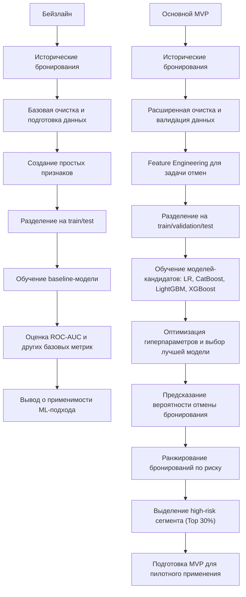
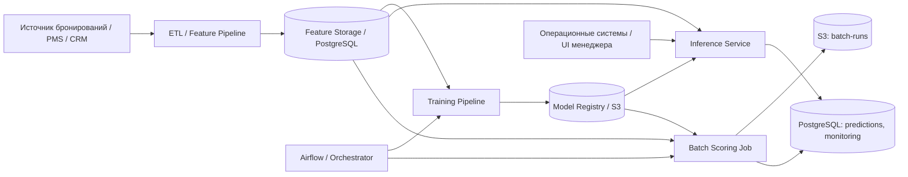

# ML System Design Doc - [RU]

## Дизайн ML системы - Прогнозирование отмен бронирований в гостиничном бизнесе

### 1. Цели и предпосылки

#### 1.1. Зачем идем в разработку продукта?  

***Бизнес-цель***  

Снизить финансовые потери от отмен бронирований и оптимизировать загрузку гостиниц за счёт прогнозирования вероятности отмены заранее. Модель будет учитывать историю клиента, сезонность, цену и тип номера, позволяя заблаговременно корректировать планирование и предлагать специальные условия, что снизит простои и повысит доходность.

***Почему станет лучше, чем сейчас, от использования ML***

Сейчас управление отменами бронирований ведётся на основе **исторических усреднённых показателей** и общих правил (например, повышенное внимание к бронированиям, сделанным менее чем за N дней до заезда, или к клиентам с предыдущими отменами), что не учитывает **индивидуальные особенности каждого бронирования** и совокупное влияние факторов, таких как сезонность, цена, тип номера и длительность проживания.

Применение ML позволит:

- **Повысить точность прогнозов отмен**, выявляя скрытые закономерности и учитывая множество факторов одновременно.
- **Снизить финансовые потери и пустые места**, позволяя заблаговременно принимать решения о перепродажах или специальных предложениях.
- **Оптимизировать работу персонала**, предоставляя готовые прогнозы и сокращая ручной труд по анализу бронирований.

***Что будем считать успехом итерации с точки зрения бизнеса***

- Увеличение дохода или сокращение потерь от отмен хотя бы на 5–10% по сравнению с текущим процессом.  
- Прогнозы модели легко доступны и понятны для сотрудников гостиницы: менеджеры используют прогнозы для принятия решений в ≥ 80% случаев.
- Модель позволяет заранее выявлять бронирования с высокой вероятностью отмены, благодаря чему менеджеры оперативно перераспределяют номера и сокращают пустые места; доля пустых мест снижается хотя бы на 5% по сравнению с текущим процессом.
- Модель предоставляет прогнозы сразу после бронирования, что позволяет при необходимости предпринимать меры (например, напоминание клиенту или предложение бонуса) без задержек.

#### 1.2. Бизнес-требования и ограничения  

***Краткое описание БТ***  

Снижение потерь от отмен бронирований за счет использования модели для раннего выявления высокорисковых бронирований. Система предоставляет для каждого бронирования оценку вероятности отмены, позволяющую бизнесу принимать более обоснованные решения.

***Бизнес-ограничения***

- Используется только исторический датасет бронирований без внешнего обогащения (CRM, платежные данные, поведение пользователей).
- Модель не должна требовать признаков, недоступных на момент принятия решения (например, данных, появляющихся после бронирования).
- Решение должно быть интерпретируемым на уровне сегментов, чтобы бизнес мог понимать, какие группы клиентов имеют повышенный риск отмены.
- Использование модели не должно ухудшать клиентский опыт (например, приводить к чрезмерно агрессивным ограничениям или дискриминации отдельных групп клиентов).

***Что мы ожидаем от конкретной итерации***  

- Построение baseline ML-решения, способного предсказывать вероятность отмены бронирования с приемлемым качеством.
- Получение воспроизводимого пайплайна подготовки данных, обучения модели и генерации предсказаний.
- Выделение сегмента высокорисковых бронирований, пригодного для использования в бизнес-логике.
- Подготовка результатов для проведения пилотного тестирования и последующей оценки бизнес-эффекта.

***Описание бизнес-процесса пилота, насколько это возможно - как именно мы будем использовать модель в существующем бизнес-процессе?***

В рамках пилота модель используется в batch-режиме для расчета вероятности отмены по всем новым бронированиям. На основе предсказаний формируется таблица с вероятностями отмены и ранжированием бронирований. Далее выделяется сегмент высокого риска (например, Top-30%) и передается бизнесу (аналитикам / операционным системам).

Возможные сценарии использования:

- Применение более строгих условий бронирования для высокорисковых клиентов
- Запуск дополнительных коммуникаций (подтверждение брони, напоминания)
- Корректировка стратегии overbooking

***Что считаем успешным пилотом***

- Модель показывает устойчивое качество на тестовых данных (например, ROC-AUC выше baseline).
- Выделенный сегмент высокого риска демонстрирует значимо более высокий уровень отмен по сравнению с остальными бронированиями.
- Бизнес может интерпретировать результаты и использовать их для принятия решений.
- Пайплайн воспроизводим и стабильно работает при повторных запусках.

***Возможные пути развития проекта***

- Внедрение онлайн-инференса и интеграция модели в операционные системы.
- Добавление внешних источников данных (CRM, поведенческие данные, платежная информация).
- Развитие feature engineering и использование более сложных моделей или ансамблей.
- Автоматизация переобучения модели и внедрение мониторинга качества (ML-метрики, PSI/CSI).
- Проведение полноценного A/B-тестирования и оценка бизнес-эффекта (снижение отмен, рост выручки).

#### 1.3. Что входит в скоуп проекта/итерации, что не входит

***На закрытие каких БТ подписываемся в данной итерации***

- Подготовка обучающей выборки: формирование витрины данных на основе предоставленного датасета бронирований (booking.csv). В витрину включаются такие признаки как история отмен бронирований, тип номера, количество ночей и тд.
- Разработка прогнозного механизма: обучение модели бинарной классификации для расчета индивидуальной вероятности отмены бронирования, на выходе формирует вероятность отмены в диапазоне от 0 до 1.
- Формирование риск-сегмента: ранжирование всех бронирований по вероятности отмены, выделение сегмента высокого риска (например, Top-30% бронирований с наибольшей вероятностью отмены).
- Подготовка к пилоту: формирование структуры данных для проведения офлайн-оценки модели и последующего A/B-тестирования.

***Что не будет закрыто***  

- Внешнее обогащение данных: использование внешних источников (CRM, платежные данные, поведение на сайте) не входит в текущую итерацию. Используется только исходный датасет и производные признаки на его основе.
- Расширение горизонта прогнозирования: модель прогнозирует только факт отмены конкретного бронирования. Другие задачи (churn, повторные бронирования) не рассматриваются.
- Автоматическое принятие бизнес-решений: система не реализует автоматические действия. Она формирует скоринг, который может использоваться для принятия решений внешними системами.
- Пост-аналитика бизнес-эффекта: оценка влияния модели на бизнес-метрики проводится после пилота и не входит в текущую итерацию.
  
***Описание результата с точки зрения качества кода и воспроизводимости решения***

Результатом является воспроизводимый ML-пайплайн, включающий:

- Подготовку данных из booking.csv,
- Предобработку признаков (очистка, кодирование категориальных переменных),
- Обучение модели,
- Генерацию предсказаний.

Пайплайн обеспечивает:

Однозначную логику обработки данных, фиксированные версии датасета и параметров модели, возможность повторного запуска на новых данных без изменения кода. Выходные данные имеют стандартизированный формат: booking_id – probability_of_cancellation – rank. Это обеспечивает возможность интеграции результата в downstream-системы и использование в аналитике.

***Описание планируемого технического долга (что оставляем для дальнейшей продуктивизации)***  

- Автоматизация (например, запуск по расписанию) откладывается до подтверждения качества модели.
- Глубокая оптимизация (grid search, Bayesian optimization) переносится на следующие этапы.
- Расширение признакового пространства, добавление новых производных признаков и более сложных зависимостей откладывается.

#### 1.4. Предпосылки решения  

***Описание всех общих предпосылок решения, используемых в системе – с обоснованием от запроса бизнеса: какие блоки данных используем, горизонт прогноза, гранулярность модели, и др.***

Использование только исходных признаков датасета недостаточно для качественного прогноза. Добавление производных признаков (total_nights, price_per_night, is_family, временные признаки) позволяет лучше отразить поведение клиентов и повысить точность модели.

- Модель решает задачу бинарной классификации — прогнозирует вероятность отмены конкретного бронирования (is_canceled), что напрямую соответствует бизнес-задаче снижения отмен.
- Гранулярность модели — уровень отдельного бронирования (booking_id), что позволяет применять результаты для каждого конкретного случая.
- Ранжирование по вероятности отмены более эффективно, чем rule-based подход, так как учитывает совокупность факторов и их взаимодействия.
- В MVP система использует только данные датасета и работает в оффлайн-режиме, что упрощает реализацию и обеспечивает воспроизводимость решения.  

---

### 2. Методология

#### 2.1. Постановка задачи

***Что делаем с технической точки зрения***

С технической точки зрения задача формулируется как задача бинарной классификации: необходимо предсказать вероятность отмены бронирования на основе доступной информации о клиенте, параметрах бронирования и контексте.

Входные данные представляют собой табличный датасет с информацией о бронированиях (характеристики клиента, тип номера, длительность проживания, цена, канал бронирования и т.д.).

Целевая переменная — is_canceled (0 — бронирование не отменено, 1 — отменено).

Модель должна:

- Принимать данные о новом бронировании сразу после его создания,
- Возвращать вероятность отмены (а не только класс),
- Работать в batch-режиме для оценки всех новых бронирований.

Результат модели используется для:

- Ранжирования бронирований по риску отмены,
- Выделения сегмента высокорисковых бронирований (например, топ-30% по вероятности),
- Передачи результатов в бизнес-процессы (уведомления, корректировка политики бронирования, overbooking).

Качество модели оценивается с использованием метрик классификации (ROC-AUC, precision/recall), с приоритетом на корректное выявление бронирований с высокой вероятностью отмены.

#### 2.2. Блок-схема решения

***Блок-схема для бейзлайна и основного MVP с ключевыми этапами решения задачи***

Блок-схема решения отражает последовательность ключевых этапов разработки ML-модели прогнозирования отмен бронирований — от подготовки данных до получения бизнес-значимого результата. Ниже представлены два уровня решения: бейзлайн для проверки гипотезы и основной MVP с расширенной предобработкой, подбором моделей и формированием целевого сегмента высокорисковых бронирований.

#### 2.3. Этапы решения задачи

Проектирование решения разбито на последовательные этапы: от формирования витрины данных на уровне бронирования до подготовки результатов для пилотного использования в бизнес-процессе управления отменами.

***Этап 1 — Подготовка данных и проектирование витрины***

На данном этапе производится подготовка аналитической витрины данных на уровне отдельного бронирования (`booking_id`) на основе исходного датасета `booking.csv`.

***Данные и валидация***

| Компонент данных | Источник формирования | Функциональное назначение | Контроль качества |
| :--- | :--- | :--- | :--- |
| **Данные бронирований** (`booking_id`, даты, цена, тип номера, канал) | Исходный датасет `booking.csv` | Формирование базовых признаков модели | Проверка типов данных, корректности дат (дата заезда > даты бронирования), удаление дубликатов |
| **Целевая переменная** (`is_canceled`) | Поле в датасете | Формирование обучающего сигнала | Проверка распределения классов, анализ дисбаланса |
| **Производные признаки** | Feature Engineering Pipeline | Учет поведения клиента и контекста бронирования | Проверка распределений, устранение выбросов |
| **Временные признаки** | Генерация на основе дат | Учет сезонности и временных паттернов | Проверка корректности календарных преобразований |

***Примеры производных признаков***

- `total_nights` — длительность проживания  
- `total_guests` — общее количество гостей
- `price_per_night` — цена за ночь
- `previous_cancel_ratio` — доля отмен клиента  

***Результат этапа***

Сформированная витрина данных (Feature Store) на уровне `booking_id`, пригодная для обучения модели и последующего скоринга.

***Этап 2 — Разработка прогнозной модели***

**Baseline:**

- Алгоритм: логистическая регрессия
- Признаки: базовые характеристики бронирования (цена, длительность, lead time)  
- Цель: задать минимальный уровень качества  

**MVP (основная модель):**

- Алгоритм: градиентный бустинг (LightGBM / CatBoost)  
- Причины выбора:
  - хорошо работает с табличными данными  
  - устойчив к нелинейным зависимостям  
  - эффективно работает с категориальными признаками  

**Feature engineering:**

- добавление взаимодействий признаков  
- временные признаки  
- агрегаты по клиенту  

***Метрики качества***

- ROC-AUC ≥ 0.70  
- Precision / Recall для класса отмен  

**Бизнес-метрика:**

- Lift в Top-30% сегменте ≥ 1.5  

**Утечка данных (data leakage):**

- исключение признаков, недоступных на момент бронирования  

**Переобучение:**

- кросс-валидация  
- регуляризация модели  

***Этап 3 — Подготовка инференса и интеграция с бизнес-процессом***

Создается пайплайн применения обученной модели к новым бронированиям в batch-режиме.

***Процесс***

1. Получение новых бронирований  
2. Применение feature engineering  
3. Расчет вероятности отмены для каждого `booking_id`  
4. Ранжирование бронирований по риску  

***Формирование сегмента***

- Выделяется Top-30% бронирований с наибольшей вероятностью отмены  
- Сегмент передается в бизнес  

***Использование результатов***

- запуск коммуникаций с клиентами  
- корректировка условий бронирования  
- управление overbooking  

---

### 3. Подготовка пилота

#### 3.1. Способ оценки пилота

Пилот в целевом варианте должен оцениваться не только по ML-метрикам, а прежде всего по **бизнес-эффекту для гостиницы**. Поэтому дизайн пилота предлагается как **offline scoring + controlled business pilot**.

**Цель пилота** — доказать, что ML-сегментация бронирований по риску отмены позволяет принимать более выгодные операционные решения, чем текущий rule-based подход, и тем самым снижает потери от отмен без ухудшения клиентского опыта.

**Дизайн пилота**

1. **Offline validation**
   - модель обучается на исторических бронированиях;
   - на hold-out выборке рассчитываются вероятности отмен;
   - проверяется качество ранжирования бронирований по риску;
   - формируется high-risk сегмент фиксированного размера, например Top-30%.

   Цель этапа — убедиться, что модель действительно концентрирует отмены в high-risk сегменте и технически пригодна к использованию в пилоте.

2. **Shadow mode / controlled pilot**
   - на новых бронированиях ежедневно выполняется batch scoring;
   - для каждого бронирования рассчитывается `probability_of_cancellation`;
   - бронирования делятся на два сценария использования:
     - **Control** — текущий процесс: ручной анализ и бизнес-правила без ML;
     - **ML/Test** — приоритизация действий на основе ML-скоринга, то есть менеджеры в первую очередь обрабатывают high-risk бронирования;
   - сами меры воздействия не меняются: напоминание клиенту, запрос подтверждения брони, корректировка условий, управление overbooking. Меняется только **способ отбора бронирований**, на которые эти действия направляются.

3. **Единица анализа** — отдельное бронирование (`booking_id`).

4. **Горизонт наблюдения** — период от создания бронирования до одного из событий:
   - отмена;
   - успешное заселение;
   - истечение окна принятия решения.

**Метрики оценки пилота**

Пилот оценивается по двум группам метрик.

**Бизнес-метрики:**

1. **Снижение доли отмен в обработанном high-risk сегменте** по сравнению с текущим процессом.
2. **Снижение потерь от отмен** — например, через уменьшение числа непроданных ночей или выпадающей выручки.
3. **Эффективность операционного воздействия** — доля бронирований, по которым после действий менеджера отмена не произошла.
4. **Операционная применимость** — менеджеры реально используют скоринг в процессе принятия решений.

**Технические метрики:**

1. `ROC-AUC` на hold-out выборке.
2. `Lift@Top-30%` — насколько high-risk сегмент концентрирует отмены лучше среднего уровня по выборке.
3. `Precision@Top-30%` — доля фактических отмен внутри high-risk сегмента.
4. Стабильность batch scoring: пайплайн выполняется без ручных исправлений и формирует результаты в стандартизированном виде.

Таким образом, пилот считается корректно поставленным только тогда, когда модель измеряется и как ML-инструмент, и как инструмент улучшения бизнес-процесса. Эта логика согласуется с тем, как в хороших примерах раздел 3 связывает модель с реальным бизнес-экспериментом.

#### 3.2. Что считаем успешным пилотом

Успешный пилот — это пилот, в котором одновременно выполняются **технические, бизнесовые и операционные** критерии.

**Бизнес-критерии успеха:**

1. **Снижение потерь от отмен не менее чем на 5%** по сравнению с текущим процессом на сопоставимом потоке бронирований.
2. **Снижение доли пустых ночей / непроданных номеров**, возникающих из-за поздних отмен.
3. **Положительный операционный эффект**: high-risk сегмент действительно помогает менеджерам лучше приоритизировать действия.
4. **Отсутствие заметного ухудшения клиентского опыта**: пилот не должен приводить к массовым ложным ужесточениям условий для низкорисковых клиентов.

**Технические критерии успеха:**

1. `ROC-AUC >= 0.70` и выше baseline.
2. `Lift@Top-30% >= 1.5`.
3. `Precision@Top-30%` заметно выше средней доли отмен по выборке.
4. Batch-пайплайн воспроизводим: повторный запуск за ту же дату не создаёт дублирующих outputs.

**Операционные критерии успеха:**

1. Полный ежедневный batch-run выполняется в пределах установленного окна расчёта.
2. Результаты формируются в виде стандартизированного файла:
   `booking_id – probability_of_cancellation – rank – risk_flag`.
3. Бизнес-пользователь понимает, как использовать high-risk сегмент в процессе работы.

Если технические метрики достигнуты, но бизнес не получает измеримого выигрыша, пилот нельзя считать полностью успешным. В этом случае следующая итерация должна быть направлена на улучшение features, изменение размера сегмента или пересмотр бизнес-правил воздействия.

#### 3.3. Подготовка пилота

Пилот в целевом варианте должен быть подготовлен не как разовая демонстрация, а как **управляемый воспроизводимый процесс**, который бизнес может использовать в тестовом режиме несколько недель подряд.

**Что требуется подготовить:**

1. **Данные для пилота**
   - исторический датасет для обучения и валидации;
   - поток новых бронирований для ежедневного batch scoring;
   - таблицу фактических исходов бронирований для последующего измерения эффекта.

2. **Технический контур**
   - обученная и зафиксированная версия модели;
   - объектное хранилище для артефактов модели и batch results;
   - оркестрация ежедневного запуска batch scoring;
   - журналирование batch-run и технических ошибок;
   - возможность повторного запуска без ручного восстановления состояния.

3. **Фиксация параметров пилота до запуска**
   - версия модели;
   - размер high-risk сегмента (например, Top-30%);
   - бизнес-правила, применяемые к сегменту;
   - период пилота;
   - список метрик, по которым оценивается успех.

4. **Формат результатов**
   - `booking_id`;
   - `scoring_date` / `run_date`;
   - `probability_of_cancellation`;
   - `rank`;
   - `risk_flag`;
   - дополнительные служебные поля для трассировки версии модели.

5. **Оценка вычислительной сложности**

Для текущей задачи используется табличная модель градиентного бустинга, поэтому вычислительные затраты умеренные:
- обучение возможно на CPU без GPU-инфраструктуры;
- batch scoring выполняется по расписанию и не требует real-time контура;
- для MVP достаточно одного вычислительного узла с Postgres, объектным хранилищем и планировщиком задач.

На этапе бейзлайна фиксируются:
- время обучения;
- время ежедневного batch scoring;
- объём памяти на прогон;
- размер результирующих файлов и артефактов.

Если расчёт показывает, что batch-run выходит за рабочее окно, параметры пилота уточняются: уменьшается частота пересчёта, упрощается feature engineering или ограничивается объём входного потока.

**Финальный результат подготовки пилота:**
- воспроизводимый scoring-процесс;
- зафиксированные параметры эксперимента;
- согласованный с бизнесом сценарий использования high-risk сегмента;
- готовность к накоплению результатов для последующей оценки экономического эффекта.

---

### 4. Внедрение в production

#### 4.1. Архитектура решения

Целевая production-архитектура должна обеспечивать два независимых, но связанных контура:

1. **Контур обучения и batch scoring**
2. **Контур онлайн-доступа к прогнозу для операционных систем**

Предлагаемая архитектура:

**Компоненты и назначение:**

- **ETL / Feature Pipeline** — формирует признаки из сырых бронирований.
- **Feature Storage / PostgreSQL** — хранит подготовленные данные, prediction records, мониторинговые таблицы и служебные статусы run-ов.
- **Training Pipeline** — обучает модель, валидирует её и публикует артефакты.
- **Model Registry / S3-compatible storage** — хранит версии модели, метрики и batch outputs.
- **Inference Service** — отдельный API-сервис для online inference по одному бронированию или небольшому batch.
- **Airflow / Orchestrator** — управляет расписанием обучения, batch scoring и валидацией outputs.
- **Batch Scoring Job** — рассчитывает прогнозы для новых бронирований по расписанию.

**Основные API-методы целевого сервиса:**

- `GET /health` — техническое состояние сервиса;
- `POST /predict` — вероятность отмены по одному бронированию;
- `POST /predict/batch` — batch scoring по списку бронирований;
- `GET /model/info` — активная версия модели и дата её публикации.

В production бизнес должен получать не просто «запущенный код», а устойчивый сервис, где модель, данные, batch scoring и журналирование разделены по зонам ответственности.

#### 4.2. Описание инфраструктуры и масштабируемости

**Выбранная целевая инфраструктура:**

- контейнеризированные сервисы;
- оркестрация batch-пайплайнов через Airflow;
- S3-совместимое хранилище для артефактов моделей и batch outputs;
- PostgreSQL как основная OLTP/metadata база;
- выделенный inference service, масштабируемый независимо от batch-контура.

**Почему именно такая схема лучше для бизнеса:**

1. **Разделение batch и online-контура** позволяет не смешивать ежедневные расчёты с запросами от операционных систем.
2. **S3 / model registry** даёт версионирование артефактов и откат модели.
3. **Airflow** позволяет явно управлять расписанием, ретраями, логами и зависимостями pipeline.
4. **PostgreSQL** удобен для хранения служебных таблиц, prediction history и мониторинга.

**Масштабируемость:**

| Компонент | MVP | Целевой production-подход |
|---|---|---|
| Inference Service | 1 инстанс | Горизонтальное масштабирование за балансировщиком |
| Airflow Workers | 1 worker | Масштабирование worker pool под batch-нагрузку |
| PostgreSQL | 1 instance | Managed PostgreSQL / реплики для чтения |
| S3 Storage | 1 bucket | Версионируемое объектное хранилище |

**Плюсы:**
- прозрачность pipeline;
- лёгкость аудита batch-run;
- разделение артефактов, данных и API;
- управляемый рост нагрузки.

**Минусы:**
- выше инфраструктурная сложность по сравнению с локальным Docker Compose;
- требуется DevOps/ML Ops контур;
- появляются затраты на managed storage, managed DB и мониторинг.

**Почему финальный выбор лучше альтернатив:**

Для бизнеса это лучше, чем «всё в одном скрипте» или только локальный запуск, потому что такая архитектура:
- воспроизводима;
- позволяет ставить SLA;
- поддерживает аудит результатов;
- даёт основу для масштабирования без полной переработки системы.

#### 4.3. Требования к работе системы

Целевые требования для production-контура:

- **Batch SLA:** ежедневный batch scoring должен завершаться в пределах согласованного ночного/утреннего окна, например **до 1 часа** на суточный объём новых бронирований.
- **API latency:** ответ `POST /predict` — не более **300–500 мс** при прогретой модели.
- **Availability SLA для inference service:** не ниже **99.5%** в рабочие часы.
- **Идемпотентность batch-run:** повторный запуск за один и тот же `run_date` не должен создавать противоречивые или дублирующие результаты.
- **Observability:** каждая batch-задача должна логировать статус, время выполнения, версию модели и количество обработанных записей.

#### 4.4. Безопасность системы

Потенциальные уязвимости целевой системы:

- несанкционированный доступ к API с прогнозами;
- компрометация секретов доступа к Postgres и S3;
- избыточные права Airflow worker или batch job;
- незащищённые внутренние сервисные соединения.

**Требования к безопасности:**

1. Все секреты должны храниться во внешнем secret manager, а не в коде и не в открытом `.env`.
2. Доступ к S3, Postgres и model registry должен выдаваться по принципу least privilege.
3. API должен быть защищён сервисной аутентификацией и, при необходимости, RBAC.
4. Внутренний трафик между сервисами должен идти по защищённым каналам.
5. Должен вестись аудит изменений конфигурации и ротация секретов.

#### 4.5. Безопасность данных

Для реального гостиничного бизнеса данные о бронированиях могут содержать персональные данные, поэтому production-система должна проектироваться с учётом:

- требований GDPR и локального законодательства;
- минимизации объёма персональных данных в ML-контуре;
- разделения персональных и аналитических идентификаторов;
- политики хранения и удаления данных;
- запрета на использование признаков, которые могут приводить к дискриминационным решениям.

В идеальном варианте модель работает на псевдонимизированных идентификаторах, а доступ к исходным персональным данным ограничен и не нужен для самого scoring-сервиса.

#### 4.6. Издержки

Издержки production-системы складываются из:

1. **Вычислительных затрат**
   - обучение модели;
   - ежедневный batch scoring;
   - поддержание online inference service.

2. **Инфраструктурных затрат**
   - object storage;
   - managed PostgreSQL;
   - orchestration platform;
   - мониторинг и логирование.

3. **Операционных затрат**
   - сопровождение модели;
   - контроль качества данных;
   - поддержка пайплайнов и релизов;
   - анализ бизнес-эффекта.

Для бизнеса такая система оправдана, если ожидаемое снижение потерь от отмен стабильно перекрывает ежемесячную стоимость эксплуатации.

#### 4.7. Integration points

Ключевые точки интеграции:

- **PMS / CRS / CRM → Feature Pipeline** — поступление новых бронирований и признаков;
- **Feature Pipeline → PostgreSQL / Feature Storage** — сохранение подготовленных данных;
- **Training Pipeline → S3 / Model Registry** — публикация модели;
- **Airflow → Batch Scoring Job** — запуск ежедневного расчёта;
- **Batch Scoring Job → S3** — сохранение outputs;
- **Batch Scoring Job → PostgreSQL** — запись prediction history и monitoring data;
- **Операционная система менеджера → Inference Service** — получение score для конкретного бронирования.

#### 4.8. Риски

Основные риски:

1. **Data drift / seasonality drift** — паттерны отмен меняются по сезонам и каналам бронирования.
2. **Недостаточный бизнес-эффект** — модель улучшает ROC-AUC, но не даёт значимого выигрыша в деньгах.
3. **Слишком много false positives** — бизнес начинает тратить усилия на бронирования, которые не были бы отменены.
4. **Плохая интеграция в процесс** — менеджеры получают скоринг, но не используют его в работе.
5. **Отсутствие версионирования outputs** — если хранить только один актуальный результат за дату, теряется история пересчётов.
6. **Операционные риски секретов и доступа** — при слабом secret management возможны инциденты безопасности.

В идеале эти риски должны закрываться регулярным мониторингом качества, контролем бизнес-метрик, версионированием модели и формализованным процессом эксплуатации.
